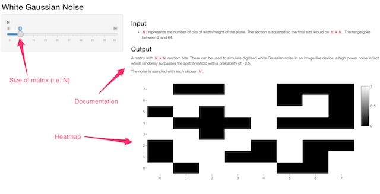

## Introduction

This presentation addresses the Shiny application developed by me for the
**Developing Data Products** course.

---
## Summary

This presentation will address the following:

- What the app does
- How to access the app and use it

---
## What the Application Does

The application generates a matrix of random bits with Gaussian distribution and outputs them in 
a heatmap plot. Here's a sample matrix of size `4 * 4`:


```
##      [,1] [,2] [,3] [,4]
## [1,]    0    0    0    0
## [2,]    1    1    1    0
## [3,]    1    0    0    1
## [4,]    0    1    0    1
```

---
## Accessing and Using the Application

In order to access the application you need to go to the following URL:
> http://35.188.93.102:3838/wgn/

In there you'll see a slider that allows you to select the dimensions of the matrix (it's a
squared matrix) and for each selection the server will generate a random matrix which will
be displayed in a heatmap on the right.


